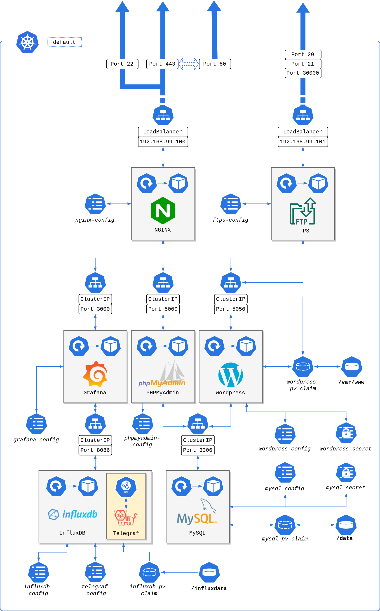

# ft_services
Webserver cluster running with Docker containers and Kubernetes

## About
FT Services is a project proposed in the 42 Schools curriculum, consisting on the implementation of a series of web services running on distinct containers orchestrated with Kubernetes.

## Note to 42 Students!
This cluster architecture doesn't represent the actual subject of the ft_services curriculim project, so beware of getting some ideas to run on your own projects. As my actual and personal view on the subject, it seems that each HTTP service must be exposed individually with a `LoadBalancer` service type. In my setup, the only HTTP service exposed is the NGINX web server, and other services can be reached with a reverse proxy configuration. More details can be seen at the Cluster Architecture section.

## Getting Started

### Installation
Before launching the setup script, the following dependencies must be satisfied:
- kubectl
- minikube
- Docker
- Virtualbox

To install the cluster on a `minikube` instance, execute the script as `./setup.sh`. This script was tested on Ubuntu Linux 20.04; other opertaional systems may not be supported.

### Running the Cluster
To access your cluster services, go to a broswer and access the IP `192.168.99.100`. In this home page, there will be several links with redirections to other services of the cluster, like the Wordpress blog and the Grafana metrics visualization tool. To access the FTPS service, run your client on the IP `192.168.99.101`.

## The Cluster

This cluster is composed of several Docker containers, all of them built from the Alpine Linux official Docker Hub image. From this perspective, each container has a different set of applications installed, reflecting the services to be exposed. The 42 School give us students freedom to choose the best tool to deploy their cluster. In this project, it has been choosen the use of the Minikube local cluster deployment tool. The **minikube** configuration is very particular to this set of applications, so here's a quick explanation of this setup:

- use of Virtual Box driver;
- use of *kubeadm* bootstrapper;
- availability of ports in range 3000 - 35000;
- availability of kubelet token authentication inside clusters;
- enabling of **dashboard**, **metrics-server** and **metallb** addons.

## The Services

### NGINX
Cluster main web server, acting as a reverse proxy to the other containers. It also serves static web pages, as the home page for this project, and support SSL connections on port 443. The access via port 80 is redirected to the secure port with code 301. The NGINX server will allow access to the other HTTP applications with the `proxy_pass` directive, but doesn't allow exposure for the databases and FTP service. Finally, its container can be accessed through SSH connection on port 22. The service is exposed as `LoadBalancer` type, exposing ports **22**, **80** and **443**.

### MySQL
Relational database to handle data needs for the Wordpress content website. It's possible to update the root password by changing the `MYSQL_ROOT_PASSWORD` on the Kubernetes manifest file. It's associated pod claims a Persistent Volume with 1Gb storage, mounted on the `/data` directory. Its service is exposded with `ClusterIP` type, exposed on the default port **3306**. 

### Wordpress
Cluster content management system, served with lighttpd web server on container port 80. The processing of dynamic web pages is made with the FastCGI module and PHP, with a *wordpress* table created on the MySQL service. The pod claims a persistent volume on `/var/www`, with 1Gb storage, to maintain web documents and to share the volume with the FTPS service. The service is exposed as `ClusterIP`, being available on port **5050**.

### PHPMyAdmin
Database management system, with graphical user interface on the browser. Doesn't allow access to the **root** user. Available on port **5000**, exposed as a `ClusterIP` service.

### InfluxDB
Time-series database system, which stores cluster metrics data to be available to the Grafana pod as a visualization tool. Requires initilization of the **Telegraf** process, with support to `kubernetes` and `kube-inventory` plugins and with a dedicated service account inside the pod. The telegraf agent gather the cluster metrics through the Kubernetes API. Exposed as a `ClusterIP` service on the port **8086**.

### Grafana
Metrics visualization tool, exposed with a WSGI server on port **3000**, as a `ClusterIP` service. The Grafana service allows the visualziation of containers and general cluster metrics, provisiened the correct dashboards and datasets.

### FTPS Server
Simple and secure FTP service with SSL security availability, connected to the mounting point on the Wordpress data directory. Therefore, Wordpress users and administrators may upload or download data from the CMS, if the respective permissions were granted. Doesn't allow anonymous users on the FTP server. Runs on passive mode through the port **30000**, with connections on ports **20** and **21** as well. Exposed with a dedicated `LoadBalancer` service type.
